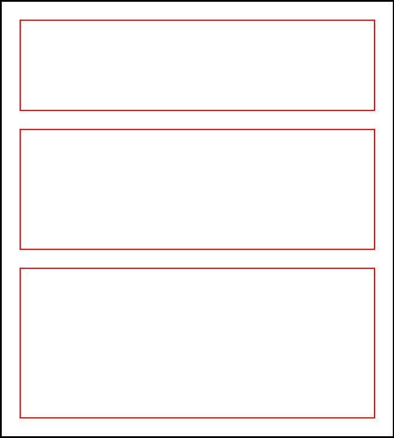
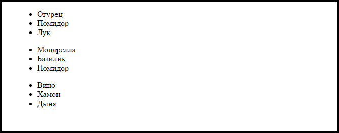
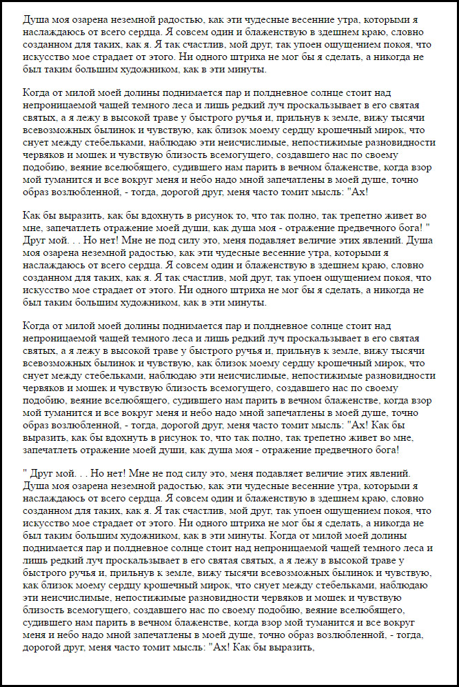

Управление блоками в потоке
===

## Описание задания:

Домашнее задание выполнять в редакторе по ссылке [Домашнее задание к лекции «Управление блоками в потоке»](https://codepen.io/Netology/pen/XzPPdX)

1. Есть три блока. Задача: сделать так, чтобы они были шириной 100 пикселей, выстроились слева направо и были выровнены вертикально по центру.

2. Есть три списка внутри родителя. Задача: сделать из них таблицу. В готовой таблице должно быть три строки по три ячейки в каждой.

3. Есть текст, разбитый на абзацы. Каждый абзац имеет свой уникальный класс. Задача: скрыть абзацы с классами `p2` и `p4`.

## Требования к заданию:

- Все задачи должны быть выполнены только с помощью CSS.
- **Нельзя** изменять HTML-разметку.

## Процесс реализации

1. Прочитать инструкцию по работе с онлайн-редактором [Codepen](https://netology-university.bitbucket.io/guides/wm/codepen-guide/).
2. Зарегистрироваться в [Codepen](https://codepen.io).
3. После регистрации перейти по ссылке [https://codepen.io/Netology/pen/XzPPdX](https://codepen.io/Netology/pen/XzPPdX).
4. Нажать кнопку <kbd>Fork</kbd>.
5. Выполнить домашнее задание.
6. Нажать кнопку <kbd>Save</kbd>.
7. Скопировать адрес из адресной строки браузера.
8. В личном кабинете на сайте [Нетологии](https://netology.ru/) открыть страницу домашней работы и вставить скопированную ссылку в поле «Комментарий к решению».

*Никакие файлы загружать не нужно.*
